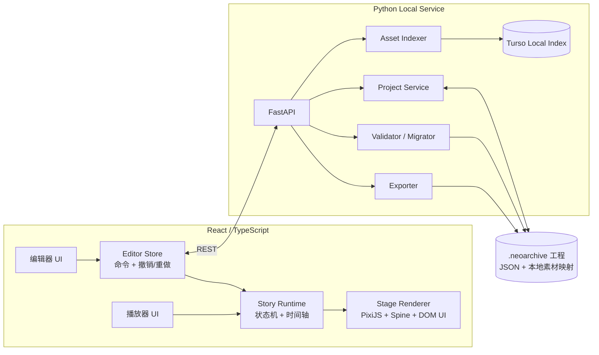
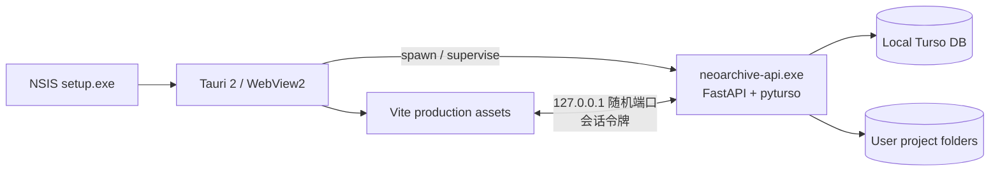

# NeoArchive 编辑器与播放器架构蓝本

更新日期：2026-08-13

## 1. 产品定位

NeoArchive 是一个本地优先的剧情编辑器兼播放器，用于制作、预览和分享《Blue Archive》风格的互动剧情工程。

第一阶段的目标不是复刻完整游戏，也不是搭建在线内容平台，而是交付一条可靠的本地制作链路：

```text
创建工程 → 导入/映射素材 → 编排场景 → 即时预览 → 校验 → 导出 → 独立播放
```

核心原则：

1. 编辑器与播放器共用同一个剧情运行时，保证“编辑器预览”和“最终播放”一致。
2. 剧情数据、用户素材和应用缓存分离，避免把第三方研究素材打进发行包。
3. 工程格式开放、带版本号、可校验、可迁移，不依赖数据库才能读取。
4. 先完成桌面 Web 原型，再用 Tauri 2 封装 Web 前端并托管 Python sidecar；第一阶段不同时维护多个原生客户端。
5. Python 负责文件、素材、校验和导出；逐帧渲染留在浏览器端，避免跨进程同步每一帧状态。

## 2. 推荐技术栈

### 前端与运行时

| 领域 | 选择 | 用途 |
| --- | --- | --- |
| 统一前端工具链 | Vite+ 0.2.x | 统一依赖管理、开发、格式化、lint、类型检查、测试与构建 |
| 应用框架 | React + TypeScript | 编辑器壳、播放器界面与共享运行时 |
| 2D 渲染 | PixiJS | 背景、角色、特效和舞台合成 |
| 骨骼动画 | `@esotericsoftware/spine-pixi-v8` | Spine 角色加载与动画控制 |
| 编辑器状态 | Zustand | 工程状态、选择状态、历史记录和 UI 状态 |
| 不可变更新 | Immer（可选，与 Zustand 配合） | 简化撤销/重做所需的状态补丁 |
| 数据校验 | JSON Schema + Ajv | 在浏览器中校验工程和场景数据 |
| 服务端状态 | TanStack Query | 管理本地 API 请求、失效和错误状态 |
| API 类型 | FastAPI OpenAPI + Orval | 自动生成接口类型，避免手写重复 DTO |
| 测试 | Vite+ Test（Vitest）+ React Testing Library + Playwright | 运行时单测、组件测试和完整编辑流测试 |

当前项目已经具备 React、PixiJS 和 Spine，不需要更换渲染路线。Zustand、Ajv 和测试工具应在对应功能真正开始实现时再加入。

音频首版直接使用 Web Audio API。只有出现移动浏览器兼容或复杂混音需求时，再评估 Howler 等封装库。

### Python 后端

| 领域 | 选择 | 用途 |
| --- | --- | --- |
| Web API | FastAPI | 本地 REST API、OpenAPI 和进度通知 |
| 数据模型 | Pydantic | 工程模型、请求响应校验和 JSON Schema 生成 |
| 服务进程 | Uvicorn | 本地开发与桌面版内置服务 |
| 素材索引 | Turso Database + `pyturso` | 本地嵌入式索引，可选显式 push/pull 同步 |
| 数据访问 | Repository + 参数化 SQL | 隔离驱动，保持索引层简单且可替换 |
| 数据迁移 | 版本化 SQL + `_schema_migrations` | 应用启动时按顺序执行本地迁移 |
| 图片处理 | Pillow | 缩略图、尺寸和格式探测 |
| 文件监听 | watchfiles | 发现用户在应用外新增、移动或修改的素材 |
| Python 工具链 | uv | Python 版本、锁文件、依赖和脚本入口 |
| 测试与质量 | pytest + Ruff + Pyright | 测试、格式/静态检查和类型检查 |
| Python 冻结 | PyInstaller `onedir` | 将 FastAPI 与原生 Python 依赖构建为 Windows sidecar |
| 桌面封装（第二阶段） | Tauri 2 + NSIS | 管理窗口、sidecar、安装、更新和系统能力 |

Turso 索引不是剧情工程的真相来源。它只保存可重建的索引与应用级信息；删除索引库后，工程仍应能从 JSON 和素材映射恢复。

`pyturso` 使用新的 Turso Database 引擎，官方将其作为 Python 本地/嵌入式场景的首选，并提供接近标准库 `sqlite3` 的接口。由于该引擎仍处于 `0.x` 阶段，应用必须通过 `AssetIndexRepository` 隔离它，不让 Turso 类型渗入业务层；如果 Windows 冻结或 SQL 兼容测试不通过，可以在不改上层代码的情况下暂时回退到 `sqlite3`。

首版不接 SQLAlchemy。素材索引查询简单，而新 Turso 驱动的 ORM 生态尚不如旧 libSQL/SQLite 路线成熟；参数化 SQL 配合小型 Repository 和版本化迁移更容易测试。不要使用已被官方标为 legacy 的 Embedded Replicas 新建同步方案。

### 2026 技术复核结论

| 候选 | 结论 | 理由 |
| --- | --- | --- |
| Tauri 2 | 最终桌面壳 | 有 Windows NSIS/MSI、权限系统、更新器和 sidecar 正式支持 |
| pywebview | 仅保留快速原型备选 | Python 友好，但安装器、更新和 sidecar 生命周期需要自行补齐 |
| Electron | 不作为默认 | 非常成熟，但会额外捆绑 Chromium/Node，当前项目收益不足 |
| `pyturso` | 采用，但设置兼容闸门 | 本地优先、可同步、官方新路线；仍需验证原生扩展冻结和 SQL 子集 |
| 旧 `libsql` Embedded Replica | 不用于新实现 | 官方已归类为 legacy，旧模式的写入仍依赖远端主库 |
| Turso Sync | MVP 默认关闭 | 本地索引无需账号或网络；后续只同步可跨设备的数据 |
| XState | 暂不引入 | 播放器状态机先用有类型的 reducer；状态复杂度明显上升后再评估 |
| `@xyflow/react` | 分支编辑阶段再引入 | 适合场景跳转图，不适合把场景内每条演出指令都节点化 |

## 3. 总体架构



### 边界规则

- `Story Runtime` 不依赖编辑器面板，也不直接调用 Python API。
- `Stage Renderer` 只消费运行时状态，不理解工程保存格式。
- 编辑操作统一转成命令，例如 `UpdateCue`、`MoveCue`、`AddScene`；撤销/重做记录命令或状态补丁。
- Python 后端不维护播放时钟。播放、暂停、逐字显示、角色动画和转场均在前端运行。
- WebSocket 或 Server-Sent Events 只用于素材扫描进度、外部文件变化等低频通知，首版没有需求时可暂缓。

### 原型阶段的能力归属（已落地）

| 能力 | 归属 | 原因与当前实现 |
| --- | --- | --- |
| Timeline 编排、拖拽、属性即时更新 | React/Zustand | 必须逐次输入立即响应，不应经过进程间通信 |
| 场景播放、逐字对白、角色／背景／过场动画 | 浏览器 StoryRuntime | 编辑器预览和成品播放器共用同一个确定性运行时 |
| 撤销／重做和 180ms 防抖草稿 | React + localStorage | 属于当前编辑会话；Python 离线时仍可继续制作 |
| 正式保存、工程列表和重新打开 | Python ProjectRepository | JSON 原子替换，revision 冲突保护，工程仍保持开放可移植 |
| Schema 与跨场景语义校验 | Python Pydantic + ProjectValidator | 统一检查重复 ID、入口、后继场景和选项目标，不依赖 UI 是否覆盖所有情况 |
| 素材扫描、哈希、尺寸探测与查询 | Python AssetScanner + Turso | 文件 I/O 和可重建索引适合后端；绝对路径不会进入剧情运行时 |
| 播放包导出 | Python ProjectExporter | 当前输出 `project.json + manifest.json` ZIP；素材收集、转码和签名从这一服务继续扩展 |
| EXE 窗口、sidecar 生命周期、随机端口与令牌 | Tauri | 只承担系统外壳和进程监管，不放剧情业务 |

前端 API 门面位于 `src/api/client.ts`，已经提供 `saveProject`、`openProject`、`listProjects`、`validateProject` 和 `exportProject`。编辑器保存按钮调用 Python 工程库；从文件导入以及 Python 离线时下载 JSON 仍作为恢复路径保留。

### Windows 桌面进程模型



Tauri 只负责系统外壳，不把业务迁移到 Rust。Python sidecar 启动时监听 `127.0.0.1` 随机端口，通过标准输出向 Tauri 完成一次性握手；Tauri 再把 API 地址和随机会话令牌注入前端。窗口退出时由 Tauri 终止 sidecar，异常退出时给出可读诊断。

开发阶段仍然使用普通浏览器访问 Vite，并单独运行 FastAPI。这样前端调试体验不受桌面壳影响。

## 4. 编辑模型

剧情采用“两层结构”：章节内用场景图表达跳转，场景内用时间轴 Cue 表达演出。

```text
Project
└── Chapter
    ├── Scene A
    │   ├── background track
    │   ├── character track
    │   ├── dialogue track
    │   ├── audio track
    │   └── effect track
    ├── Scene B
    └── Scene C
```

- **Scene**：剧情跳转的最小单位，具有 `nextSceneId` 或选项分支。
- **Track**：编辑器中的视觉分组，不承担业务逻辑。
- **Cue**：运行时真正执行的原子指令，包含开始时间、类型、参数和可选持续时间。
- **AssetRef**：稳定的逻辑引用，不在剧情中写绝对文件路径。

首版 Cue 类型控制在以下范围：

| 分类 | Cue 类型 | 说明 |
| --- | --- | --- |
| 背景 | `background.set` | 切换背景，可指定淡入时间 |
| 角色 | `character.enter` | 放置角色并播放入场动画 |
| 角色 | `character.update` | 修改位置、缩放、表情或动画 |
| 角色 | `character.exit` | 角色退场 |
| 对白 | `dialogue.show` | 显示说话人、身份和正文，可等待用户继续 |
| 音频 | `audio.play` / `audio.stop` | 播放或停止 BGM、语音和音效 |
| 演出 | `effect.play` | 黑屏、震动、闪白或简单滤镜 |
| 分支 | `choice.show` | 显示选项并跳转至目标场景 |
| 控制 | `wait` | 固定等待或等待用户输入 |

示例场景数据：

```json
{
  "id": "scene-classroom-001",
  "title": "清晨的教室",
  "nextSceneId": "scene-rooftop-001",
  "cues": [
    {
      "id": "cue-bg-001",
      "type": "background.set",
      "atMs": 0,
      "assetRef": "background/classroom",
      "transitionMs": 400
    },
    {
      "id": "cue-character-001",
      "type": "character.enter",
      "atMs": 0,
      "characterRef": "character/sakurako-idol",
      "animation": "Idle_01",
      "transform": { "x": 0.5, "y": 0.8, "scale": 1.65 }
    },
    {
      "id": "cue-dialogue-001",
      "type": "dialogue.show",
      "atMs": 450,
      "speaker": "Sakurako",
      "subtitle": "Trinity General School",
      "text": "老师，今天也请允许我陪你一起完成这份档案。",
      "typingCps": 36,
      "waitForAdvance": true
    }
  ]
}
```

坐标统一使用舞台归一化值：`x/y` 通常为 `0..1`，允许为实现画外入场而短暂越界；缩放使用倍率而不是百分数字符串。编辑器可显示为百分比，但保存时必须是数值。

## 5. 播放器运行时

播放器应实现明确的有限状态机：

```text
idle → loading → playing → waiting_user → playing → completed
                    ↕           ↕
                  paused      paused
                       ↘ error ↙
```

运行时职责：

1. 按 `Scene.cues` 的数组顺序执行剧本模块，并维护背景、角色、对白、音频与特效的投影状态。`atMs` 仅作为 schemaVersion 1 旧工程兼容字段，不再决定对白顺序。
2. 处理继续、自动播放、快进、暂停、选项和跳转。
3. 使用单调时钟计算播放进度，不使用连续累加的 `setInterval` 作为真相来源。
4. 支持从场景开头重放。任意时间点 Seek 可在第二阶段通过状态快照实现。
5. 对未知 Cue 给出诊断并安全跳过；不能让整个项目因单个扩展指令崩溃。

编辑器预览只是给同一运行时传入 `preview` 模式：允许从选中 Cue 启动、热更新可视参数，并关闭不可逆的外部行为。

## 6. 工程格式

推荐扩展名为目录型 `*.neoarchive/`：

```text
example-story.neoarchive/
├── project.json
├── chapters/
│   ├── chapter-001.json
│   └── chapter-002.json
├── assets/
│   └── manifest.json
├── localization/
│   └── zh-CN.json
└── .neoarchive/
    ├── autosave/
    ├── cache/
    └── diagnostics.json
```

`project.json` 至少包含：

- `schemaVersion`
- `projectId`
- `title`
- `entrySceneId`
- `chapters`
- `createdAt` / `updatedAt`
- `appVersion`

`assets/manifest.json` 只保存逻辑资源 ID、类型、相对路径或资源库映射、哈希和可选元数据。默认不复制研究素材；导出时只打包用户明确拥有分发权且主动选择嵌入的素材。

保存策略：

1. 前端编辑状态标记为 dirty。
2. 自动保存写入 `.neoarchive/autosave/`，不覆盖正式文件。
3. 用户保存时，后端先校验，再写临时文件并原子替换目标 JSON。
4. 请求携带 `revision`；若文件已被外部修改，返回冲突而不是静默覆盖。
5. 每个 `schemaVersion` 都有显式迁移函数，迁移前自动备份。

## 7. Python API

基础前缀：`/api/v1`

| 方法 | 路径 | 说明 |
| --- | --- | --- |
| `GET` | `/health` | 服务与版本检查 |
| `GET` | `/projects` | 列出本机正式保存的工程 |
| `GET` | `/projects/{projectId}` | 打开工程、返回 revision 与诊断 |
| `PUT` | `/projects/{projectId}` | 校验并原子保存；可携带 revision 防止覆盖外部修改 |
| `POST` | `/projects/validate` | 对未保存工程执行完整语义校验 |
| `POST` | `/assets/scan` | 扫描素材库并更新 Turso 索引 |
| `GET` | `/assets` | 查询素材索引 |
| `GET` | `/assets/{assetId}/content` | 流式读取本地素材，支持 Range |
| `POST` | `/projects/{projectId}/export` | 导出可播放包 |

缩略图、项目素材映射、扫描进度事件和 `.aap` 导入器保留为下一阶段扩展点；它们尚未进入原型 API，避免用空接口制造“已经实现”的错觉。

错误响应统一包含：

```json
{
  "code": "PROJECT_REVISION_CONFLICT",
  "message": "Project was modified outside NeoArchive.",
  "details": {},
  "requestId": "req_..."
}
```

本地服务只监听 `127.0.0.1`。桌面版启动时生成随机会话令牌，并限制允许的 Origin；所有文件路径必须经 `resolve` 后确认位于已授权工程目录或素材库目录内，禁止直接把任意绝对路径映射为静态文件。

## 8. 推荐目录结构

在现有原型验证完成后，再逐步迁移到以下结构：

```text
NeoArchive/
├── frontend/
│   ├── src/
│   │   ├── app/                 # 启动、模式和路由
│   │   ├── editor/              # 场景树、时间线、属性面板
│   │   ├── player/              # 播放控制与播放页面
│   │   ├── runtime/             # 状态机、Cue 调度与投影状态
│   │   ├── renderer/            # PixiJS、Spine、DOM 对话层
│   │   ├── project-schema/      # 生成的 TS 类型与前端校验
│   │   ├── api/                 # 生成的 API 类型与客户端
│   │   └── shared/              # 无业务含义的通用组件
│   └── tests/
├── backend/
│   ├── neoarchive/
│   │   ├── api/                 # FastAPI routers 与依赖
│   │   ├── domain/              # Pydantic 工程模型
│   │   ├── services/            # 项目、素材、校验、导出
│   │   ├── persistence/         # Turso repository 与 SQL 迁移
│   │   ├── importers/           # .aap 等只读导入器
│   │   └── main.py
│   └── tests/
├── src-tauri/                   # Tauri 2 外壳、权限与 sidecar 生命周期
├── schemas/                     # 生成并提交的 JSON Schema
├── docs/
├── research-assets/             # 本地研究资源，保持忽略
└── scripts/                     # 开发、生成类型和打包入口
```

不要立即进行纯目录重构。先抽出 `runtime` 和一份真实可保存的工程模型；当后端开始接入时，再移动到 `frontend/` 与 `backend/`，这样每一步都有可运行结果。

## 9. 编辑器界面范围

Galgame 创作工作流、剧本/舞台/流程三视图、播放器功能和变量/存档模型的详细设计见 [`GALGAME_FEATURE_BLUEPRINT.md`](GALGAME_FEATURE_BLUEPRINT.md)。

桌面编辑器使用以下六个区域：

1. **项目/场景树**：章节、场景、跳转关系和新增操作。
2. **资源库**：背景、角色、音频和特效，支持搜索、筛选和拖入舞台。
3. **舞台**：16:9 即时预览、选中框、拖拽定位、安全区和网格。
4. **时间线**：轨道、Cue、播放头、吸附和基础缩放。
5. **属性面板**：编辑当前 Scene、Cue 或舞台对象。
6. **诊断栏**：缺失素材、无效跳转、未知动画和导出错误。

首版采用场景列表 + 线性时间线。节点图只在实现分支剧情后加入；即使引入节点图库，也只用于编辑场景之间的跳转，不用于替代场景内部时间线。

## 10. MVP 验收范围

### 必须完成

- 创建、打开、保存一个目录型工程。
- 背景、单角色 Spine、对白、BGM/语音和简单淡入淡出。
- 场景增删改排序；Cue 增删改和时间线拖动。
- 舞台内拖动角色并编辑 X/Y/Scale。
- 播放、暂停、继续、自动播放和从当前场景重播。
- 缺失素材、无效场景跳转和未知动画的可读诊断。
- 撤销/重做、自动保存与外部修改冲突提示。
- 导出一个无需编辑器 UI 的只读播放器包。

### 明确不进入 MVP

- 多人实时协作和账号系统。
- 云素材市场、评论、点赞或社区发布。
- 视频渲染导出。
- 完整移动端编辑器。
- 插件执行任意 Python/JavaScript 代码。
- 复杂粒子系统、实时 3D 和完整原作功能复刻。
- `.aap` 的无损双向兼容；首版只做结构探测和单向导入。

## 11. 实施顺序

### 里程碑 A：共享播放器内核

- 将当前硬编码场景改为 `Project → Scene → Cue` 数据。
- 抽出运行时状态机和 Cue dispatcher。
- 保持现有 Sakurako、背景和对白 UI 作为金丝雀场景。
- 为顺序执行、等待继续、暂停和场景跳转编写单元测试。

验收：同一份内存 JSON 能在编辑器预览模式和独立播放器模式得到一致画面与交互。

### 里程碑 B：可编辑、可撤销

- 接入编辑器 store 和命令系统。
- 完成场景列表、属性编辑、舞台拖拽和基础时间线。
- 实现撤销/重做和 dirty 状态。

验收：用户不编辑 JSON，也能完成一段“背景 + 角色 + 对白 + 音频”的剧情。

### 里程碑 C：Python 本地服务

- 建立 FastAPI/Pydantic 工程。
- 实现项目读写、Schema 校验、原子保存和资源读取。
- 建立 `pyturso` 素材索引、缩略图和哈希缓存。
- 先完成 Windows `pyturso + PyInstaller onedir` 冻结冒烟测试；失败时由 Repository 临时回退 `sqlite3`。
- 从 OpenAPI 生成前端 API 类型。

验收：关闭并重新打开应用后，工程完整恢复；路径穿越和 revision 冲突测试通过。

### 里程碑 D：导出与桌面封装

- 构建只读播放器入口。
- 导出工程清单、授权素材与构建后的播放器。
- 用 PyInstaller `onedir` 冻结 Python sidecar。
- 用 Tauri 2 管理 sidecar，并生成 Windows NSIS `setup.exe`。
- 增加启动令牌、Origin 检查、子进程回收、单实例和自动更新策略。

验收：在未安装 Node.js、Python 和 Rust 的 Windows 10/11 测试机上，可安装、打开工程并完整播放。

### 里程碑 E：分支与旧工程导入

- 加入选项、条件和场景图。
- 实现 `.aap` 探测报告与第一批字段映射。
- 对无法转换的字段保留原值并生成诊断。

## 12. 关键决策与风险

1. **Spine 运行时许可**：项目发布前必须确认 Spine Runtime 与素材的授权边界；研究资源不能因技术上可加载就默认可再分发。
2. **浏览器音频限制**：首次播放通常需要用户手势解锁 AudioContext，播放器入口必须显式处理。
3. **本地文件安全**：后端是本地服务也不能信任路径参数；必须限制根目录、防路径穿越并校验符号链接。
4. **保存冲突**：自动保存不能覆盖用户在外部编辑器中的修改，必须使用 revision/mtime/hash 检测。
5. **运行时与编辑器耦合**：时间线面板不能成为播放器逻辑来源；所有播放行为必须经过共享 runtime。
6. **数据库滥用**：剧情正文进入 Turso 会削弱可移植性和 Git 可读性，应坚持 JSON 为工程真相来源。
7. **过早节点化**：对白演出本质是有序时间轴；把每条指令都画成节点会迅速降低可读性。
8. **新引擎兼容性**：`pyturso` 是官方新路线但仍为 `0.x`。首次承诺发布前必须通过 Windows 原生扩展冻结、崩溃恢复、事务和 10 万条素材查询测试。
9. **错误同步对象**：素材绝对路径是设备私有数据。未来启用 Turso Sync 时，只同步内容哈希、逻辑 ID、标签和用户元数据；每台设备单独维护 `hash → local path` 映射。
10. **同步冲突**：Turso Sync 当前采用 last-push-wins，不把它当作多人协作协议，也不直接用它同步正在共同编辑的剧情正文。

## 13. Windows 构建流水线

Windows 包必须在 Windows runner 上构建，不能依赖开发者在 macOS 上交叉冻结 Python：

```text
uv sync --frozen
→ 前后端测试
→ Vite production build
→ PyInstaller onedir 构建 neoarchive-api.exe
→ sidecar + pyturso 启动/查询冒烟测试
→ Tauri build --bundles nsis
→ 干净 Windows VM 安装与播放器冒烟测试
→ 对 setup.exe 和应用二进制签名
```

`onedir` 是 sidecar 的发布形态，不等于用户会看到一堆散文件；Tauri/NSIS 会把它们安装到应用目录。它避免 Python `onefile` 每次启动都先解压原生依赖，也更方便排查 `pyturso`、Pillow 和 Spine 资源的收集问题。

## 14. 交接给实现者的第一批任务

1. 定义 Pydantic `Project`、`Chapter`、`Scene` 与判别联合 `Cue` 模型，生成第一版 JSON Schema。
2. 在前端建立对应 TypeScript 类型，并把当前三个硬编码场景转换成 fixture。
3. 实现无 UI 依赖的 `StoryRuntime`，先支持背景、角色、对白、等待和跳转。
4. 让当前舞台订阅 runtime 的投影状态，而不是直接读取 React 页面中的硬编码常量。
5. 增加 `/editor` 与 `/player` 两种入口，让它们加载同一份 fixture。
6. 完成 runtime 单元测试后，再开始 FastAPI 的工程保存接口。

在进入正式功能开发前，增加一个独立的“技术闸门”任务：在 `windows-latest` 上将仅包含 FastAPI、Pydantic 和 `pyturso` 的最小程序冻结为 sidecar，并由 Tauri 启动后完成建库、写入、查询和退出。这个验证通过后，再把 Turso 和 Tauri 作为不可逆的工程基础。

这六项完成后，NeoArchive 就从“视觉原型”进入了可持续开发的产品框架。

## 15. 官方资料

- [Turso SDK 选型](https://docs.turso.tech/sdk/introduction)
- [Turso Python Quickstart](https://docs.turso.tech/sdk/python/quickstart)
- [Turso Sync 用法](https://docs.turso.tech/sync/usage)
- [Turso Sync 冲突处理](https://docs.turso.tech/sync/conflict-resolution)
- [Tauri 2 Sidecar](https://v2.tauri.app/develop/sidecar/)
- [Tauri 2 Windows Installer](https://v2.tauri.app/distribute/windows-installer/)
- [PyInstaller 文档](https://pyinstaller.org/en/stable/)
